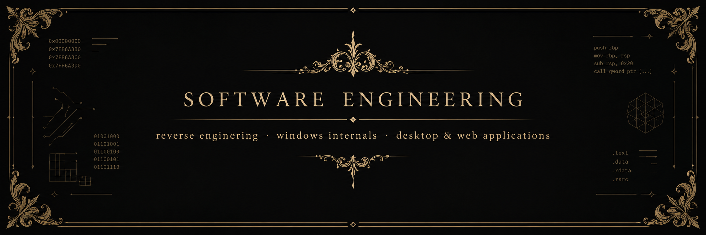
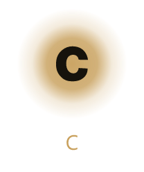
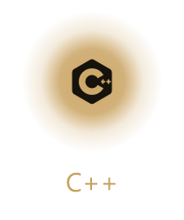
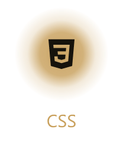
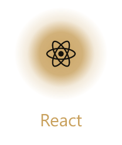
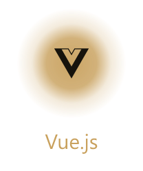

  

 

### about me

<table>
  <tr>
    <td width="33%" valign="top">
      <strong>agentic workflow</strong> 
      i consistently use AI to help me create 20x faster, being able to work up to 14h per day
    </td>
    <td width="33%" valign="top">
      <strong>windows internals</strong> 
      digging into windows binaries to find novel methods, nothing is an obstacle
    </td>
    <td width="33%" valign="top">
      <strong>desktop & web</strong> 
      i have a full specialization in web development, whether it is desktop or web i can provide
    </td>
  </tr>
</table>

### how i use AI

AI is often associated with slop, however with how quickly it improved it now only depends on your usage, i wrote a full guide / cheatsheet on how to use it well [here](https://github.com/xop01/ai_goodpractice)  

it allows me to create like never before and it is such an amazing opportunity to use it in any kind of projects to speed up your work  

# stack

**languages**

  
  
  
  
  

**web**

  
  

## public projects

### `ai_goodpractice`
full guide / cheatsheet on getting useful work done with coding agents

[**view repository**](https://github.com/xop01/ai_goodpractice)

### `project-progress-mcp`
a zig mcp to keep the goals, notes, documentations and tells the agent when the session is stale

[**view repository**](https://github.com/xop01/project-progress-mcp)

## private projects

### `ultradumper`
dumps binaries or shellcodes out of a running windows process, including memory mapped from kernel through tools like [Blackbone](https://github.com/DarthTon/Blackbone)

- usermode

### `kernel-monitor-edr`
kernel-level monitoring your windows to defend against threats

- kernel

### `pdb_provider`
reads a windows pdb over http and returns the rva for a symbol

  <strong>is that all you've built ?</strong> 
  no i have many more projects that i am unable to speak about and some i reserve for me and friends 

   

  <strong>contact</strong> 
  send a private message <a href="https://x.com/xopp1e">@xopp1e</a>

